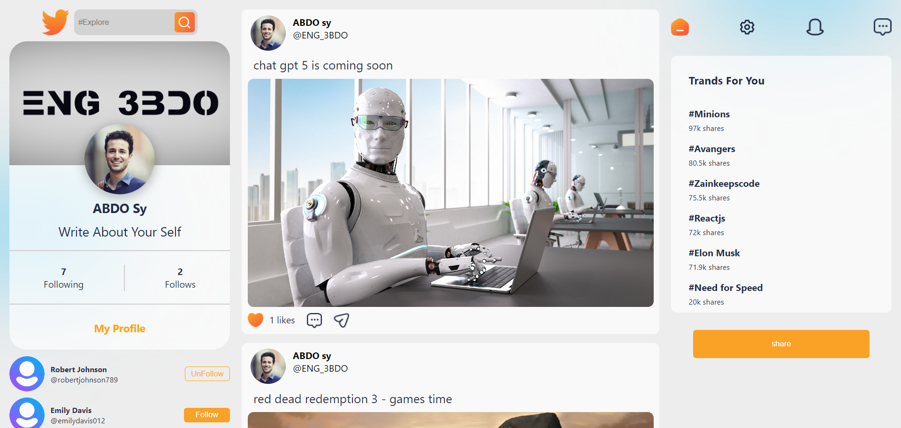

# Social Media App Project

  

## Project Description

The Social Media App project aims to create a chat application where users can create accounts and input their information such as name, username, and social status. Users can create posts and follow other users, as well as edit their personal information. The website includes pages such as login, sign up, home, and account information.

## Technologies Used

- React JS: Frontend development.
- React Router: Handling navigation within the application.
- Axios: Handling HTTP requests.
- Mongoose: Object Data Modeling (ODM) library for MongoDB and Node.js.
- Express: Web application framework for Node.js.
- REST API: Backend API for handling CRUD operations.
- MVC Architecture: Separation of concerns for better code organization.
- Password Hashing: Secure storage of user passwords.
  
## Features

1. **Authentication**: Users can sign up and log in to their accounts securely.
2. **Profile Management**: Users can edit their personal information.
3. **Posting**: Users can create and share posts.
4. **Following**: Users can follow other users to see their posts.
5. **Responsive Design**: The application is designed to be accessible on various devices.

## Project Structure

- **frontend**: Contains the frontend code written in React JS.
- **backend**: Contains the backend code written in Express.
- **database**: Contains the MongoDB database schema.

## Getting Started

To run the project locally, follow these steps:

1. Clone the repository: `git clone https://github.com/3bd0sy/Social-Media-App.git`
2. Navigate to the project directory: `cd Social-Media-App`
3. Install dependencies:
   - Frontend: `cd client && npm install`
   - Backend: `cd server && npm install`
4. Start the development server:
   - client: `npm start`
   - server: `npm start`

## Future Improvements

1. **Real-time Chat**: Implement real-time messaging functionality.
2. **Notifications**: Add notification system for new followers, likes, and comments.
3. **Search Functionality**: Allow users to search for other users and posts.
4. **Privacy Settings**: Implement privacy settings for user accounts and posts.
